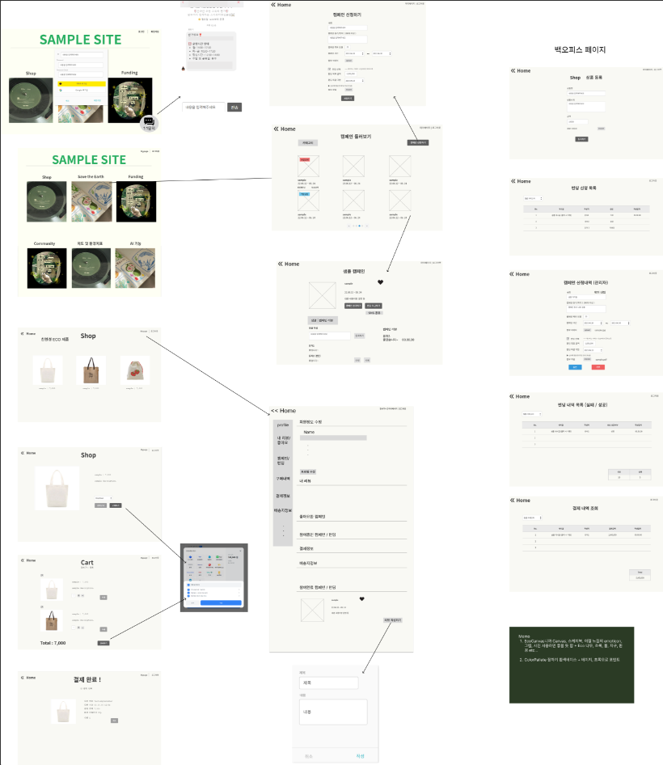
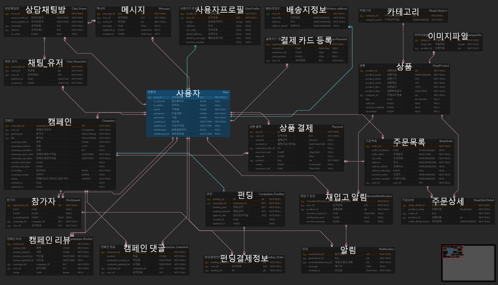

# Project: EcoCanvas

 

## 🎉 프로젝트 소개

### 프로젝트 이름

> EcoCanvas

### 프로젝트 기획 의도

> - 오늘날 갈수록 심각해지는 환경오염에 따라 친환경에 대한 사회적인 관심이 높아지고 있습니다.
> - 하지만 막상 어떻게 친환경을 실생활에서 실천할 수 있는지 알지 못하는 경우가 많습니다.
> - 저희는 이러한 문제를 의식하여 환경 캠페인 생성/참여 & 캠페인에 펀딩하기를 주요 기능으로 하고 친환경 상품 쇼핑 등의 부가 기능들을 제공하여 사용자들의 친환경 캠페인 참여 또는 친환경 제품 사용을 독려하는 웹 페이지 제작을 기획 했습니다!

### 개발기간

> 2023/06/05 ~ 2023/07/10

 

## 🎬 프로젝트 시연

<!--   -->

 

## 📜 기능 소개

### 사용자

> 회원가입, 로그인, 회원정보 관리, 팔로우, 비활성화, 아이디/비밀번호 찾기 기능 등등

### 관리자

> 사용자 정보 관리, 상품 등록/수정/삭제, back-office, 기능 등등

### 캠페인

> 캠페인 신청, 참여 기능

### 캠페인 후기(리뷰)

> 작성/수정/삭제, 조회수 카운트, 좋아요, 검색 기능

### 후기 댓글

> 작성/수정/삭제 기능

### 펀딩

> 펀딩 예약 결제, 결제 취소 기능

### 쇼핑

> 상품 상세 보기, 결제, 결제 취소 기능

 

## 🔨 팀 구성

|  이름  | 맡은 기능                                                               |
| :----: | :---------------------------------------------------------------------- |
| 박지홍 | 백오피스, 배포, 백엔드/프론트, 프로젝트 방향성 & 전반적인 기능 검수     |
| 송지명 | 부팀장, git repository 담당, 펀딩 & 쇼핑 결제 기능, 백엔드/프론트       |
| 이주한 | 팀장, 구글 소셜 로그인, 코드 외적인 팀 서포트(readme 초안, notion 관리) |
| 장소은 | 프로젝트 주제 & 아이디어, 카카오 소셜 로그인, 쇼핑 기능, 백엔드/프론트  |
| 최준영 | 캠페인(주요 기능!), 캠페인 모델링 수정, readme 관리, 백엔드/프론트      |

 

## 🔧 Tech Stack

### Back-end

>   

### Front-end

>    

### Server

>          > 

### Management

>  

### Database

> 

 

## 📚 사용한 API

### 소셜 로그인

> KAKAO OAuth 2.0 API / Google OAuth 2.0 API

### 결제

>

 

## 📋 배포 전략

 

## 🎨 [Wireframe](https://www.figma.com/file/Jh0ZRKqUuXPomqyxCVQMzr/Untitled?type=design&node-id=0-1&t=kZSkorEHGW2sxhpQ-0)

 

## 🛢 [ERD](https://www.erdcloud.com/d/rcy9tc32bPmgHN6gn)

 

## 📜 EcoCanvs Notion

> [EcoCanvas Notion](https://bedecked-block-34c.notion.site/EcoCanvas-S-A-Starting-Assignments-19d4c100c18a408b8eb647d7201828d0?pvs=4)

 

## 🧪 Test Code Case

USER TEST CODE

## 회원가입

## 회원정보 수정/비활성화

## 로그인

## 로그아웃

## 토큰 유효 확인

## 비밀번호 변경

## 비밀번호 찾기

Campaign TEST CODE

REVIEW TEST CODE

Shop TEST CODE

 

## 🔗 Link

### [Front-end Repository](https://github.com/Songjimyung/EcoCanvas-Frontend)

### [트러블 슈팅](https://bedecked-block-34c.notion.site/Error-log-9bf480bc93e74b5e86c9d670f3bc5005?pvs=4)

### [배포 사이트](https://www.ecocanvas.net)
